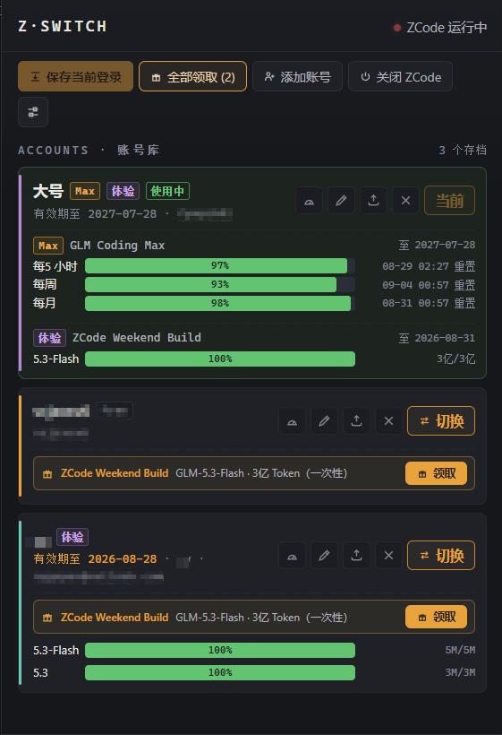

# SwitchSuite

**简体中文** ｜ [English](README.en.md)

ZCode 与 WorkBuddy 双后端账号管理器（Tauri 2 桌面应用）：顶栏页签切换两套独立后端。

- **ZCode 页签**：多账号一键切换、额度展示、活动领取、多开、加密导入导出、托盘 / 开机自启 / CLI
- **WorkBuddy 页签**：多账号一键换号（凭据级，通常无需重新登录）、会话按账号留存与自动恢复、扫码添加账号、一键签到、积分查询、OpenAI 兼容网关、会话复制（真共享）、备份回滚



## 下载

到 [Releases](https://github.com/Danjack85/SwitchSuite/releases) 下载 `SwitchSuite_*_x64-setup.exe`（NSIS，按当前用户安装）。首次运行 Windows SmartScreen 可能提示 —— 点「更多信息 → 仍要运行」。

## WorkBuddy 页签：会话为什么不会丢

WorkBuddy 用 `user_id` 做数据隔离，客户端只显示当前登录账号名下的会话。本工具把会话按 **owner** 长期留存本地、登录时自动恢复该账号的会话；一条会话的归属存在于**三个位置**（正文文件 / `workbuddy.db` 索引 / `edge-sync` 云端映射），工具会三处一起维护，并在界面显示两条一致性状态。

- **换号** = 切换可见性：各账号会话原样保留，切回即恢复
- **复制**（真共享）= 给目标账号一份新 id 的独立副本，两边各有一份互不影响，带谱系防重复
- **划归** = 移动归属（三处一起改）

WorkBuddy 引擎是随应用分发的 Python 侧车（`sidecar/wbswitch/`），启动约 0.3 秒、输出 UTF-8 JSON 信封，由 Rust 侧经 Tauri shell 插件调用（参数经类型化白名单校验，路径只从受信来源推导）。

## ZCode 页签

沿用 zcode-switch 的全部能力，见下文原说明。

<details>
<summary>原 zcode-switch 说明</summary>

## 功能

- **保存 / 切换账号**：一键切换登录身份；切换前自动保全当前登录，绝不丢号；设备身份跟账号走，远程控制中继密钥跨切换保活
- **多开**：每个账号可另开一个独立的 ZCode 窗口，与主窗口同时在线（各用各的登录，互不影响）
- **添加账号**：工具内 OAuth 登录新号（BigModel / z.ai 双入口），全程不动当前登录
- **额度展示**：账号行内联显示套餐额度与重置时间，多套餐分组
- **活动领取**：可领套餐一键领取；「自动领取」开关（默认关）定时自动检测并领取
- **加密导入导出**：`.zsb` 捆绑包，PBKDF2(100k) + AES-256-GCM 口令加密
- **中英双语** / **托盘** / **开机自启** / **CLI 自动化**

## CLI

```
zcode-switch.exe --cli state|list
zcode-switch.exe --cli quota [--id <账号id>]
zcode-switch.exe --cli capture [--name 名称]
zcode-switch.exe --cli switch --id <id> [--force] [--restart|--no-restart]
zcode-switch.exe --cli open --id <id>      # 多开
zcode-switch.exe --cli export-all --out <all.zsb>
zcode-switch.exe --cli import --file <file.zsb>
```

CLI 密码（export / import）：优先环境变量 `ZSW_PASSWORD`，也可 `--password <密码>`。

</details>

## WorkBuddy CLI（同一 exe，侧车引擎）

```
wbswitch.exe state|list|capture|switch --id <id>
wbswitch.exe sessions [--capture|--activate|--copy|--adopt|--sync-cloud]
wbswitch.exe login|checkin|credits|models|serve|backup|backups|rollback|diagnose|bodies|history|gui
```

## 自己构建

```bat
npm install
npx tauri build
```

产物：`src-tauri/target/release/bundle/nsis/*.exe`。WorkBuddy 侧车已随仓库提交（`src-tauri/sidecar/`）；如需从源码重建侧车，见 [workbuddy-switch](https://github.com/Danjack85/workbuddy-switch) 仓库（`build-sidecar.spec`）。

## 安全设计

- **本地优先**：所有数据在本地，无遥测、无远端存储
- **WorkBuddy 侧车**：参数只能来自类型化白名单（拒绝 `-` 开头，杜绝参数注入）；可执行路径只从受信来源推导（不信环境变量）；出站请求限 https + 官方域名白名单 + 拒绝内网地址（凭据不会外泄）
- **防丢号**：切换前自动保全未入库登录；文件写入走临时文件 + 原子 rename
- **路径穿越防护**：账号 id 白名单（`[A-Za-z0-9-]`）
- **加密导出**（ZCode）：PBKDF2-HMAC-SHA256(100k) + AES-256-GCM

## 使用声明

两个后端都通过本地方式复用**你自己账号**的登录态与额度，不破解、不绕过计费。但「以非官方客户端形态转发」（WorkBuddy 网关）可能不符合上游服务条款，风险自负；请勿用于批量账号运营。与腾讯官方无关。

## 致谢与来源

- ZCode 后端基于 [pjpv/zcode-switch](https://github.com/pjpv/zcode-switch)（MIT）——本仓库即在其源码上扩展
- WorkBuddy 引擎来自 [Danjack85/workbuddy-switch](https://github.com/Danjack85/workbuddy-switch)（MIT），会话归属「三件套」模型参考了 changexbc/workbuddy-switch 与 babygoton/WorkDaddy 的公开实现思路

## License

MIT
